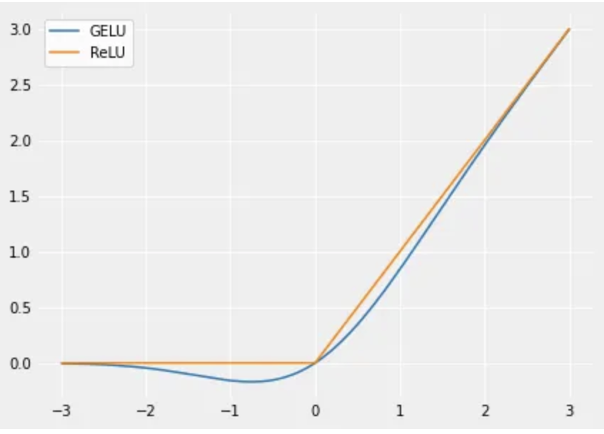

## 1. Overview

GLU (Gated Linear Unit) variants are gating mechanisms used in modern neural networks, particularly in transformers. They combine linear transformations with element-wise gating to control information flow.

**Core Concept: Gating**

The fundamental idea is to use one part of the input to gate (control) another part:
```
Output = Gate(x) ⊙ Transform(x)
```

where ⊙ represents element-wise multiplication.

---

---

## 2. GLU (Gated Linear Unit)

**Formula:**
```
GLU(x) = (xW + b) ⊙ σ(xV + c)
```

**Detailed Explanation:**

GLU introduces a **gating mechanism** that controls information flow through element-wise multiplication. Unlike fixed activation functions (ReLU, tanh), GLU learns to gate features based on the input context.

The mechanism works in two parallel paths:
1. **Value path:** `xW + b` - computes the candidate values to output
2. **Gate path:** `σ(xV + c)` - computes gating coefficients ∈ [0, 1]

The sigmoid ensures smooth, differentiable gating where:

- σ(x) → 1: fully pass the value through
- σ(x) → 0: suppress the value
- σ(x) ≈ 0.5: partial activation

**Key Advantage:** The gate is **input-dependent** and **learned**, allowing the network to dynamically control which features are relevant for a given input pattern.

**Toy Example:**

Let's say we have input `x ∈ ℝ³` and want output dimension 2.
```
Input: x = [1.0, -0.5, 2.0]

Learned parameters:
W = [[0.5, -0.3],      V = [[0.2,  0.8],
     [0.2,  0.6],           [-0.5, 0.3],
     [-0.1, 0.4]]           [0.7, -0.2]]

Bias: b = [0.1, -0.2]      c = [0.0, 0.5]
```

**Step 1: Compute value path**
```
xW + b = [1.0, -0.5, 2.0] @ W + [0.1, -0.2]
       = [0.5×1 + 0.2×(-0.5) + (-0.1)×2,  -0.3×1 + 0.6×(-0.5) + 0.4×2] + [0.1, -0.2]
       = [0.2, 0.3] + [0.1, -0.2]
       = [0.3, 0.1]
```

**Step 2: Compute gate path**
```
xV + c = [1.0, -0.5, 2.0] @ V + [0.0, 0.5]
       = [0.2×1 + (-0.5)×(-0.5) + 0.7×2,  0.8×1 + 0.3×(-0.5) + (-0.2)×2] + [0.0, 0.5]
       = [1.85, 0.25] + [0.0, 0.5]
       = [1.85, 0.75]

σ(xV + c) = [σ(1.85), σ(0.75)]
          = [0.864, 0.679]
```

**Step 3: Element-wise multiplication (gating)**
```
GLU(x) = [0.3, 0.1] ⊙ [0.864, 0.679]
       = [0.259, 0.068]
```

**Interpretation:**
- First dimension: value=0.3 gets 86.4% activation → 0.259
- Second dimension: value=0.1 gets 67.9% activation → 0.068

The network learned that for this input pattern, the first dimension should be emphasized more (high gate value) while the second dimension should be partially suppressed.

**Key Points:**
- Uses sigmoid (σ) as the gate
- Splits input into two linear transformations
- One path is gated by the sigmoid of the other
- Introduced in "Language Modeling with Gated Convolutional Networks" (2017)

**Characteristics:**
- Gates values between 0 and 1
- Smooth gating mechanism
- Can suppress or allow information flow
- The gating is **content-dependent**: different inputs produce different gate values
- More expressive than fixed activations: can learn complex, non-linear feature selection

---

---

## 3. GELU (Gaussian Error Linear Unit)

**Formula:**
```
GELU(x) = x · Φ(x)
```
where Φ(x) is the cumulative distribution function of standard normal distribution.

**Approximation (commonly used):**
```
GELU(x) ≈ 0.5x(1 + tanh[√(2/π)(x + 0.044715x³)])
```

<figure markdown>
  { width=500 }
  <figcaption>GELU v/s ReLU</figcaption>
</figure>

**Key Points:**
- Not strictly a GLU variant, but often grouped with them
- Used in BERT, GPT-2, GPT-3
- Smooth, non-monotonic activation
- Stochastic regularizer interpretation: multiplies input by Bernoulli distributed mask

**Why it matters:**
- Default activation in many modern transformers
- Better gradient flow than ReLU in deep networks

---

---

## 4. SwiGLU (Swish-Gated Linear Unit)

**Formula:**
```
SwiGLU(x) = Swish(xW) ⊙ (xV)
```
where Swish(x) = x · σ(βx), and β is typically set to 1.

Expanding this:
```
SwiGLU(x) = [(xW) · σ(xW)] ⊙ (xV)
```

<figure markdown>
  { width=500 }
</figure>

**Detailed Explanation:**

SwiGLU combines the **Swish activation** (also called SiLU - Sigmoid Linear Unit) with the gating mechanism. This creates a two-stage gating process:

1. **First gating (Swish internal):** `xW` is self-gated by its own sigmoid: `(xW) · σ(xW)`
2. **Second gating (GLU mechanism):** The result is then used to gate the value path `xV`

**Why Swish?**

Swish has several advantages over simpler activations:
- **Smooth and non-monotonic:** Unlike ReLU (hard threshold at 0), Swish smoothly transitions
- **Self-gating property:** The `x · σ(x)` formulation means the function gates itself
- **Bounded below, unbounded above:** Values can grow without bound for positive inputs, but are bounded near 0 for negative inputs
- **Better gradient flow:** Smoother derivatives help with training deep networks

**Visual Intuition:**

For Swish(x) = x · σ(x):
- When x = -5: Swish ≈ -0.033 (nearly zero, but not exactly)
- When x = 0: Swish = 0
- When x = 5: Swish ≈ 4.966 (nearly linear for large positive values)
- The function dips slightly below zero for negative inputs before recovering

**Toy Example:**

Let's trace through SwiGLU with input `x ∈ ℝ³` and output dimension 2.
```
Input: x = [2.0, -1.0, 1.5]

Learned parameters:
W = [[0.4,  0.2],      V = [[0.3, -0.5],
     [-0.3, 0.5],           [0.6,  0.2],
     [0.2,  0.1]]           [-0.2, 0.4]]
```

**Step 1: Compute xW (pre-activation for gate)**
```
xW = [2.0, -1.0, 1.5] @ W
   = [0.4×2 + (-0.3)×(-1) + 0.2×1.5,  0.2×2 + 0.5×(-1) + 0.1×1.5]
   = [1.4, 0.05]
```

**Step 2: Apply Swish to get the gate**
```
Swish(xW) = (xW) · σ(xW)
          = [1.4, 0.05] · [σ(1.4), σ(0.05)]
          = [1.4, 0.05] · [0.802, 0.512]
          = [1.123, 0.026]
```

**Step 3: Compute value path**
```
xV = [2.0, -1.0, 1.5] @ V
   = [0.3×2 + 0.6×(-1) + (-0.2)×1.5,  -0.5×2 + 0.2×(-1) + 0.4×1.5]
   = [-0.3, -0.6]
```
**Step 4: Apply gating**
```
SwiGLU(x) = Swish(xW) ⊙ (xV)
          = [1.123, 0.026] ⊙ [-0.3, -0.6]
          = [-0.337, -0.016]
```

**Interpretation:**
- First dimension: value=-0.3 gets amplified by gate=1.123 → -0.337
- Second dimension: value=-0.6 gets heavily suppressed by gate=0.026 → -0.016

Notice that unlike sigmoid (bounded [0,1]), Swish can produce gate values > 1, allowing **amplification** not just suppression!

**Key Advantages of SwiGLU:**

1. **Enhanced expressiveness:** The Swish gate can amplify (gate > 1) or suppress (gate < 1), unlike sigmoid which only suppresses
2. **Smoother gradients:** Swish's smoothness helps optimization in very deep networks
3. **Empirically superior:** Consistently outperforms other GLU variants in large-scale experiments
4. **Widely adopted:** Current best practice in production LLMs (LLaMA, PaLM, Mistral, etc.)

**Key Points:**
- Combines Swish activation with gating
- Used in PaLM, LLaMA, Mistral, and most modern LLMs
- β is typically set to 1
- Empirically outperforms other GLU variants in large language models
- Gates can amplify (>1) not just suppress, unlike sigmoid-based GLU

**Why it's important:**
- State-of-the-art for LLMs
- Better performance-to-parameter ratio
- Industry standard in modern architectures
- The go-to choice for new transformer implementations

---

---

## 5. GeGLU (GELU-Gated Linear Unit)

**Formula:**
```
GeGLU(x) = GELU(xW) ⊙ (xV)
```

**Key Points:**
- Uses GELU as the gating function
- Proposed in "GLU Variants Improve Transformer" (2020)
- Slightly better than standard FFN in transformers
- More common in vision transformers

---

---
## 6. ReGLU (ReLU-Gated Linear Unit)

**Formula:**
```
ReGLU(x) = ReLU(xW) ⊙ (xV)
```

**Key Points:**
- Uses ReLU as gating function
- Simpler and faster than smooth variants
- Good baseline for comparison
- Less commonly used in practice than SwiGLU/GeGLU

---

## Implementation Consideration

**Parameter Count:**
GLU variants require **~1.5x parameters** compared to standard activations because they split the input into two paths.

Example FFN comparison:
```python
# Standard FFN
hidden = activation(x @ W1)  # W1: d_model → d_ff
output = hidden @ W2          # W2: d_ff → d_model

# GLU variant FFN
gate = activation(x @ W_gate)   # W_gate: d_model → d_ff
value = x @ W_value             # W_value: d_model → d_ff
hidden = gate * value           # Element-wise multiplication
output = hidden @ W2            # W2: d_ff → d_model
```

To maintain the same parameter count, implementations often use:
- d_ff = (2/3) × original_d_ff when using GLU variants

---

## Comparison Summary

| Variant | Gate Function | Used In | Characteristics |
|---------|--------------|---------|-----------------|
| GLU | Sigmoid | CNNs, early work | Smooth gating, 0-1 range |
| GELU | - | BERT, GPT-2/3 | Smooth, probabilistic interpretation |
| SwiGLU | Swish | LLaMA, PaLM | SOTA for LLMs, best empirical performance |
| GeGLU | GELU | Vision Transformers | Good for transformers, smooth |
| ReGLU | ReLU | Baseline | Simple, sparse activation |

---

---

## Interview Questions

1. **Why GLU variants?** They provide learnable, dynamic gating that helps models control information flow more effectively than static activations.

2. **Trade-off:** Better performance but ~1.5x parameters (or reduced hidden dimension for same param count).

3. **Current best practice:** SwiGLU is the most common choice for modern LLMs (LLaMA, PaLM, etc.).

4. **When to use:**
   - SwiGLU: Language models, general-purpose transformers
   - GeGLU: Vision transformers, when you want GELU-like smoothness
   - GELU: Simpler architectures without gating overhead

5. **Mathematical intuition:** Gating allows the network to learn which activations to pass through and which to suppress, providing more expressiveness than fixed activation functions.

---
